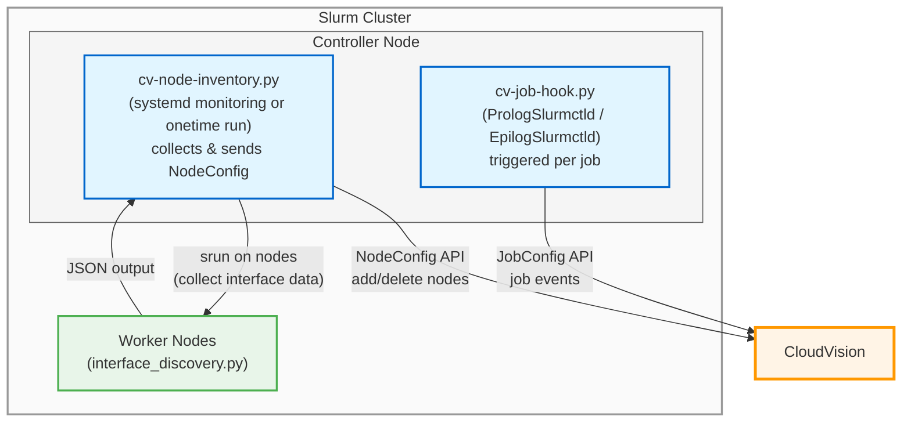

# CloudVision Slurm Job Integration

Reference scripts for integrating a Slurm cluster with [Arista CloudVision](https://www.arista.com/en/products/eos/eos-cloudvision) to enable job-aware network troubleshooting and monitoring.

## Architecture



## How It Works

### Job lifecycle → JobConfig API (`cv-job-hook.py`)

`cv-job-hook.py` is executed twice for each job:

1. **When a job is allocated** (via `PrologSlurmctld`)
   - `SLURM_SCRIPT_CONTEXT=prolog_slurmctld`
   - Script builds a JobConfig payload with state `JOB_STATE_RUNNING`
   - Uses `SLURM_JOB_ID`, `SLURM_JOB_NAME`, `SLURM_JOB_PARTITION`, `SLURM_JOB_START_TIME`, and `SLURM_JOB_NODELIST`
2. **When a job finishes** (via `EpilogSlurmctld`)
   - `SLURM_SCRIPT_CONTEXT=epilog_slurmctld`
   - Script inspects `SLURM_JOB_EXIT_CODE`, `SLURM_JOB_EXIT_CODE2`, and `SLURM_JOB_DERIVED_EC`
   - Derives final state: `JOB_STATE_COMPLETED`, `JOB_STATE_FAILED`, or `JOB_STATE_CANCELLED`
   - Includes `end_time` in the payload

**Resource allocation mode:** by default this integration uses **node mode**:

- `nodes.values` carries a list of node names from `SLURM_JOB_NODELIST`
- Assumes each node is dedicated to a single job while that job is running
- CloudVision interprets this as: *all switch interfaces connected to these nodes are associated with the job*

If you run multiple independent jobs on the same node concurrently, this simple node-based model will not distinguish which interfaces belong to which job.

> The CloudVision **JobConfig** API also supports an *interface mode* where `interfaces.values` carries a list of worker interface MAC addresses for each job. This gives finer-grained, per-interface visibility when jobs use only a subset of interfaces on a node.
However, the Slurm job hook (`cv-job-hook.py`) only sees standard Slurm environment variables (such as `SLURM_JOB_NODELIST`) and **cannot automatically learn which specific interfaces a job is using**. If you want to send interface MACs instead of node names, you must add your own mechanism to pass that information into the hook  and extend the script accordingly.


### Node inventory → NodeConfig API

The node-side reporting is decoupled from job execution and is handled by `cv-node-inventory.py`.

The script supports two execution modes:

#### 1. Continuous monitoring mode (`--monitor` flag)
Run as a systemd service for automatic node monitoring:
```bash
cv-node-inventory.py --monitor                      # Start monitoring
cv-node-inventory.py --monitor --poll-interval 120  # Custom poll interval
```
- **This is the default integration mode** when using `make install`
- Runs as a systemd service (`cv-node-inventory.service`)
- Periodically polls `sinfo` to detect node changes (default: every 60 seconds)
- **For added nodes**: runs `srun` only on new nodes to collect interface data and sends NodeConfig create requests
- **For removed nodes**: sends NodeConfig delete requests to CloudVision
- Runs initial inventory collection on startup for all available nodes
- Logs all node changes and inventory updates to systemd journal
- Ensures CloudVision always has up-to-date node inventory without manual intervention

#### 2. One-time mode - For manual execution
Run manually from command line to collect and send NodeConfig for all available nodes:
```bash
cv-node-inventory.py          # Collect from all nodes
cv-node-inventory.py -v       # With debug logging
```
- This is the script's default behavior when run without flags
- Collects interface data from all available nodes
- Sends NodeConfig to CloudVision for all nodes
- Exits after completion
- Useful for initial setup, testing, troubleshooting, or manual updates

#### How it works:
- Controller gets cluster name from `scontrol show config` (ClusterName parameter)
- Uses `sinfo` to list all worker nodes
- For each node, runs `interface_discovery.py` via `srun` (job name: `cv-interface-discovery`) to collect interface data
- The worker script on each node:
  - Gets node name from `SLURMD_NODENAME` environment variable
  - Gets hostname from `socket.gethostname()`
  - Uses `/sys/class/net` (sysfs) to discover physical interfaces (prefixes: `eth`, `eno`, `ens`, `enp`, `em`)
  - Reads MAC addresses from `/sys/class/net/<iface>/address`
  - Gets IP addresses using `ip addr show <iface>`
  - Ignores loopback and interfaces without MAC or IP addresses
  - Returns interface data as JSON to the controller
- Controller sends NodeConfig API calls to CloudVision with collected data

**Important Notes:**
- All CloudVision API calls are made from the controller node only. Worker nodes do not need network access to CloudVision.
- **ClusterName must be configured in `slurm.conf`**. The script will abort if it cannot determine the cluster name to prevent sending data to the wrong location.

## Installation

### Quick Start

Use the provided Makefile to install both JobConfig and NodeConfig reporting:

```bash
# Install the integration (requires API_SERVER and API_TOKEN)
make install API_SERVER=www.arista.io API_TOKEN=your-token-here

# The Makefile will:
# 1. Install Python dependencies (requests library)
# 2. Copy scripts to /opt/slurm/cloudvision/
# 3. Configure API credentials in the scripts
# 4. Add PrologSlurmctld/EpilogSlurmctld hooks to slurm.conf
# 5. Install and start cv-node-inventory.service for continuous monitoring (recommended)
# 6. Restart slurmctld
```

**Default behavior:** The Makefile installs `cv-node-inventory.service` which runs the script in **continuous monitoring mode** (`--monitor` flag). This ensures CloudVision always has up-to-date node inventory as nodes are added or removed from the cluster.

**To obtain `API_SERVER` and `API_TOKEN`:**
- See [CloudVision API Documentation](https://aristanetworks.github.io/cloudvision-apis/connecting)
- API token requires permissions to write JobConfig and NodeConfig

**Customization:**

You can customize the installation by passing variables to `make install`:

```bash
# Customize installation paths
make install \
  API_SERVER=www.arista.io \
  API_TOKEN=your-token \
  SLURM_CONF_DIR=/custom/slurm/conf \
  INSTALL_DIR=/custom/path \
  LOG_DIR=/var/log/custom 
```

Available variables:
- `API_SERVER` (required) - CloudVision API server
- `API_TOKEN` (required) - CloudVision API token
- `SLURM_CONF_DIR` (default: `/etc/slurm`) - Slurm configuration directory
- `INSTALL_DIR` (default: `/opt/slurm/cloudvision`) - Installation directory
- `LOG_DIR` (default: `/var/log/slurm`) - Log directory

**Post-installation configuration:**

After installation, you can modify additional settings directly in the installed scripts:

**In `/opt/slurm/cloudvision/cv-job-hook.py`:**
- `LOG_FILE` - Log file path (default: `/var/log/slurm/cvjob.log`)
- `LOG_LEVEL` - Log verbosity: "DEBUG", "INFO", "WARNING", "ERROR" (default: "INFO")
- `JOB_NAME_FILTER` - Regex to filter jobs by name (default: exclude jobs starting with "cv-")
- `PARTITION_FILTER` - List of partitions to monitor, e.g., `["gpu", "compute"]` (default: None = all partitions)

**In `/opt/slurm/cloudvision/cv-node-inventory.py`:**
- `POLL_INTERVAL` - Seconds between node checks in monitor mode (default: 60)
- `IFACE_NAME_REGEX` - Regex to match interface names (default: `r"^(eth|eno|ens|enp|em).*"`)
- `INTERFACE_DISCOVERY_JOB_NAME` - Job name for srun interface discovery (default: "cv-interface-discovery")

<details>
<summary><b>Manual Installation Guide</b></summary>

If you prefer manual installation or need more control over the installation process:

**JobConfig Reporting (`cv-job-hook.py`):**

1. Copy `cv_api.py` and `cv-job-hook.py` to your controller node:
   ```bash
   mkdir -p /opt/slurm/cloudvision
   cp cv_api.py cv-job-hook.py /opt/slurm/cloudvision/
   chmod +x /opt/slurm/cloudvision/cv-job-hook.py
   ```

2. Edit `/opt/slurm/cloudvision/cv-job-hook.py` and set:
   - `API_SERVER` – CloudVision API server (e.g., `www.arista.io`)
   - `API_TOKEN` – CloudVision API token

3. Configure Slurm hooks in `/etc/slurm/slurm.conf`:
   ```
   PrologSlurmctld=/opt/slurm/cloudvision/cv-job-hook.py
   EpilogSlurmctld=/opt/slurm/cloudvision/cv-job-hook.py
   ```
   **See the [Slurm Prolog and Epilog documentation](https://slurm.schedmd.com/prolog_epilog.html) for details.**

4. Restart slurmctld:
   ```bash
   systemctl restart slurmctld
   ```

**NodeConfig Reporting (`cv-node-inventory.py`):**

1. Copy scripts to the controller node:
   ```bash
   cp cv_api.py cv-node-inventory.py interface_discovery.py /opt/slurm/cloudvision/
   chmod +x /opt/slurm/cloudvision/cv-node-inventory.py
   chmod +x /opt/slurm/cloudvision/interface_discovery.py
   ```

2. Edit `/opt/slurm/cloudvision/cv-node-inventory.py` and set:
   - `API_SERVER` – CloudVision API server
   - `API_TOKEN` – CloudVision API token

3. **Recommended: Install continuous monitoring service** (default integration mode):
   ```bash
   # Copy the service file
   cp cv-node-inventory.service /etc/systemd/system/

   # Enable and start the service
   systemctl daemon-reload
   systemctl enable cv-node-inventory.service
   systemctl start cv-node-inventory.service
   # Check status
   systemctl status cv-node-inventory.service
   # View logs
   journalctl -u cv-node-inventory.service -f
   ```

4. **Alternative: Run once manually** (for testing or manual updates):
   ```bash
   /opt/slurm/cloudvision/cv-node-inventory.py
   # or with DEBUG logging:
   /opt/slurm/cloudvision/cv-node-inventory.py -v
   ```

</details>

### Behavior and Failure Handling

**JobConfig hook:**
- If `API_SERVER` or `API_TOKEN` is not set, the script logs a warning and **exits successfully** without blocking the job.
- If the CloudVision API call fails, a log message is emitted but the Slurm job is **not** failed or delayed.
- Job states are derived from Slurm exit codes and signals to distinguish normal completion, failure, and cancellation.

**Node inventory (`cv-node-inventory.py`):**
- **Recommended deployment: Continuous monitoring mode** (`--monitor` flag via systemd service):
  - This is the default integration mode installed by `make install`
  - Runs continuously as a systemd service, polling for node changes every 60 seconds (configurable via `--poll-interval`)
  - Only collects interface data from newly added nodes (optimized performance)
  - Sends NodeConfig delete requests for removed nodes
  - Automatically restarts if it crashes (configured in systemd service)
  - Logs all node changes and inventory updates to systemd journal
  - Can be monitored with: `systemctl status cv-node-inventory.service`
  - View logs with: `journalctl -u cv-node-inventory.service -f`
- **One-time mode** (script default when run manually without flags): If a single node fails to report NodeConfig, the script logs a warning and continues processing the remaining nodes. Exits with code 1 if any failures occurred.

## Data Sent to CloudVision

**JobConfig (from `cv-job-hook.py`):**
- `key.id` – Slurm job ID (from `SLURM_JOB_ID`)
- `location` – Slurm cluster name (from `SLURM_CLUSTER_NAME`)
- `name` – Slurm job name with partition in format `job_name@partition` (from `SLURM_JOB_NAME` and `SLURM_JOB_PARTITION`, e.g., `my-training-job@gpu`)
- `state` – `JOB_STATE_RUNNING`, `JOB_STATE_COMPLETED`, `JOB_STATE_FAILED`, or `JOB_STATE_CANCELLED` (derived from `SLURM_SCRIPT_CONTEXT`, `SLURM_JOB_EXIT_CODE`, `SLURM_JOB_EXIT_CODE2`, `SLURM_JOB_DERIVED_EC`)
- `start_time` – ISO 8601 UTC timestamp (from `SLURM_JOB_START_TIME`)
- `end_time` – ISO 8601 UTC timestamp (from `SLURM_JOB_END_TIME`, only when the job has finished)
- `nodes.values` – Array of node names allocated to the job (from `SLURM_JOB_NODELIST`)

**NodeConfig (from `cv-node-inventory.py`):**
- `key.id` – Node name (from `SLURMD_NODENAME` on worker node)
- `location` – Slurm cluster name (from `scontrol show config` ClusterName on controller)
- `hostname` – Node hostname (from `socket.gethostname()` on worker node)
- `data_interfaces.values` – Array of objects (from `/sys/class/net` on worker node):
  - `name` – Interface name (e.g. `eth0`)
  - `mac_address` – MAC address in lower-case (from `/sys/class/net/<iface>/address`)
  - `ip_addresses.values` – List of IPv4 addresses assigned to the interface (from `ip addr show <iface>`)

**Privacy Notes:**
- ✅ No user data, code, or training data is sent
- ✅ No job logs or output is sent
- ✅ No environment variables or secrets are sent
- ✅ Only job metadata and basic node interface info are sent


<details>
<summary><b>Example API Payloads</b></summary>

### JobConfig API - Job Started

```json
{
  "key": {
    "id": "12345@hpc-cluster-west"
  },
  "name": "gpt-training@gpu",
  "state": "JOB_STATE_RUNNING",
  "start_time": "2025-12-05T10:30:00Z",
  "location": "hpc-cluster-west",
  "nodes": {
    "values": [
      "gpu-node-1",
      "gpu-node-2",
      "gpu-node-3",
      "gpu-node-4"
    ]
  }
}
```

### JobConfig API - Job Finished

```json
{
  "key": {
    "id": "12345@hpc-cluster-west"
  },
  "name": "gpt-training@gpu",
  "state": "JOB_STATE_COMPLETED",
  "start_time": "2025-12-05T10:30:00Z",
  "end_time": "2025-12-05T12:45:30Z",
  "location": "hpc-cluster-west",
  "nodes": {
    "values": [
      "gpu-node-1",
      "gpu-node-2",
      "gpu-node-3",
      "gpu-node-4"
    ]
  }
}
```

### NodeConfig API - Node Interface Inventory

```json
{
  "key": {
    "id": "gpu-node-1"
  },
  "location": "hpc-cluster-west",
  "hostname": "gpu-node-1",
  "data_interfaces": {
    "values": [
      {
        "name": "eth0",
        "mac_address": "aa:bb:cc:dd:ee:01",
        "ip_addresses": {
          "values": ["192.168.1.11"]
        }
      },
      {
        "name": "eth1",
        "mac_address": "aa:bb:cc:dd:ee:02",
        "ip_addresses": {
          "values": ["192.168.2.11"]
        }
      }
    ]
  }
}
```

</details>

## Tenant Scheduler Integration (Alternative Use Case)

<details>
<summary><b>Click to expand</b></summary>

> **Note:** This section describes an alternative use case for HPC-as-a-Service providers integrating tenant schedulers with CloudVision. This is separate from the regular Slurm job monitoring described above.

The `send_jobconfig()` API utility function in `cv_api.py` supports a tenant mode (`isTenantJob=True`) for reporting tenant allocations to CloudVision. Tenant allocations appear on the **CloudVision Tenant Dashboard** (separate from the regular Job Dashboard).

**Use Case:**
- HPC-as-a-Service or GPU-as-a-Service providers with multi-tenant schedulers
- Track which network resources are allocated to each tenant
- Correlate network issues to specific tenant workloads

**How It Works:**

Tenant schedulers must call `send_jobconfig()` directly at these lifecycle points:

1. **Tenant Allocation**: Call with `job_state='JOB_STATE_RUNNING'` and `isTenantJob=True`
2. **Resource Change**: Call with updated `nodes` or `interfaces` when tenant resources scale
3. **Tenant Deallocation**: Call with `job_state='JOB_STATE_COMPLETED'` and `isTenantJob=True`

**Example Integration:**

```python
from cv_api import send_jobconfig

# When tenant is allocated resources
send_jobconfig(
    api_server="www.arista.io",
    api_token="your-api-token",
    job_id="tenant-unique-id",
    job_name="tenant-abc",
    location="hpc-cluster",
    job_state="JOB_STATE_RUNNING",
    nodes=["compute-node-1", "compute-node-2"],
    start_time="2025-12-05T10:30:00Z",
    jobconfig_mode="node",
    isTenantJob=True
)

# When tenant allocation ends
send_jobconfig(
    api_server="www.arista.io",
    api_token="your-api-token",
    job_id="tenant-unique-id",
    job_name="tenant-abc",
    location="hpc-cluster",
    job_state="JOB_STATE_COMPLETED",
    nodes=["compute-node-1", "compute-node-2"],
    start_time="2025-12-05T10:30:00Z",
    end_time="2025-12-06T18:00:00Z",
    jobconfig_mode="node",
    isTenantJob=True
)
```

</details>

## ⚠️ Disclaimer

> This repository provides **reference implementations** for integrating Slurm jobs with CloudVision. It is intended as a starting point for users to adapt and customize for their specific environments.
>
> **This is not a fully supported Arista product.** Users are responsible for reviewing, testing, and modifying this code to meet their security and operational requirements. By using this code, you acknowledge it is provided as-is for reference purposes.
